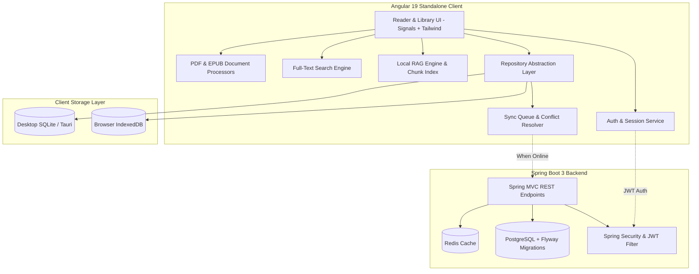

# Folio — Local-First Intelligent Digital Library & Document Engine

[](https://angular.dev/)
[](https://spring.io/projects/spring-boot)
[](https://www.typescriptlang.org/)
[](https://www.oracle.com/java/)
[](https://www.postgresql.org/)
[](https://www.docker.com/)
[](LICENSE)

> **Folio** is a production-grade, privacy-focused, offline-first digital library and document reader engineered with an **Angular 19 standalone frontend** (Signals reactivity + Tailwind CSS), **local RAG semantic search** with exact page citations, **live multi-tab conflict resolution**, and a **Spring Boot 3 / PostgreSQL cloud synchronization backend** with JWT authentication.

---

## 🌟 Flagship Highlights

- **100% Offline-First Architecture**: Zero external network dependency required for full operation. State, reading progress, and documents are stored client-side in an IndexedDB / SQLite abstraction layer with collision-safe UUIDs.
- **Production User Authentication**: Full user lifecycle management with BCrypt password hashing, stateless JWT signing, token persistence, and profile verification. Includes 1-click Demo credentials for instant portfolio evaluation.
- **Local RAG-Powered Book Q&A**: Extracts, chunks, and vector-indexes book passages to perform semantic retrieval and generate answers with exact page & chapter source citations offline via local Ollama (`llama3.2` / `nomic-embed-text`) or a built-in offline engine.
- **Visual Offline Sync & 3-Way Conflict Resolver**: Queues mutations offline with idempotency tokens and broadcasts across tabs using `BroadcastChannel`. Detects simultaneous modifications and renders an interactive side-by-side three-way diff & merge screen.
- **Sub-50ms Full-Text Search**: In-memory tokenized full-text search indexing across metadata and extracted book contents using `MiniSearch` with live query duration counters and highlighted snippet extraction.
- **Polished PDF & EPUB Readers**: Integrated with PDF.js and ePub.js featuring dynamic theme switching (Dark, Light, Sepia, Solarized), zoom/fit scaling, bookmarks, highlights, notes, and debounced reading progress persistence.

---

## 🏛️ System Architecture



---

## 📁 Repository Structure

```text
folio/
├── frontend/                   # Angular 19+ standalone frontend
│   ├── nginx.conf              # Production Nginx reverse proxy & SPA configuration
│   ├── src/
│   │   ├── app/
│   │   │   ├── core/           # Storage, Auth, RAG, Search, Sync, Repositories
│   │   │   ├── features/       # Library, Reader, Auth, Search, AI Q&A, Sync Demo, Settings
│   │   │   └── shared/         # Navbar, Sidebar, modals & UI primitives
│   │   └── environments/       # Environment configs (dev & prod)
├── backend/                    # Spring Boot 3 Java 17 backend
│   ├── src/main/java/          # Controllers, AuthService, JwtService, JPA entities, Security
│   └── src/main/resources/     # Flyway migrations (V1, V2) & application configs
├── desktop/                    # Tauri configuration for native desktop packaging
├── docker/                     # Multi-stage Dockerfiles & docker-compose.yml
└── .github/workflows/          # GitHub Actions CI/CD automation pipeline
```

---

## 🚀 Quick Start Guide

### Option 1: Full-Stack with Docker Compose (Recommended)

Run the entire stack (PostgreSQL, Redis, Spring Boot Backend, Angular Frontend with Nginx SPA reverse proxy):

```bash
cd docker
docker-compose up --build
```
- **Web App**: `http://localhost`
- **Backend API**: `http://localhost:8080/api/v1`
- **Health Check**: `http://localhost:8080/actuator/health`

### Option 2: Local Development

#### 1. Frontend (Angular 19)
```bash
cd frontend
npm install
npm start
```
Runs at `http://localhost:4200`.

#### 2. Backend (Spring Boot 3)
```bash
cd backend
./mvnw spring-boot:run
```
Runs at `http://localhost:8080` (uses standalone H2 in-memory DB in `dev` profile, or PostgreSQL in `prod`).

---

## 🔒 Security & Authentication

- **Stateless JWT**: Standard Authorization header format `Bearer <token>`.
- **Password Protection**: BCrypt salted hashing with strength 10.
- **Role & Route Protection**: Public auth/registration and sync endpoints; secured user profiles and sync operations.
- **Cross-Origin Resource Sharing (CORS)**: Configured via Spring `CorsConfigurationSource` to support multi-domain deployments.

---

## 🧪 Testing & Validation

```bash
# Frontend build & typecheck
cd frontend && npm run build

# Backend compilation & test compile
cd backend && ./mvnw test-compile
```

---

## 📄 License

MIT License. Designed with engineering rigor, privacy by design, and clean architecture.
