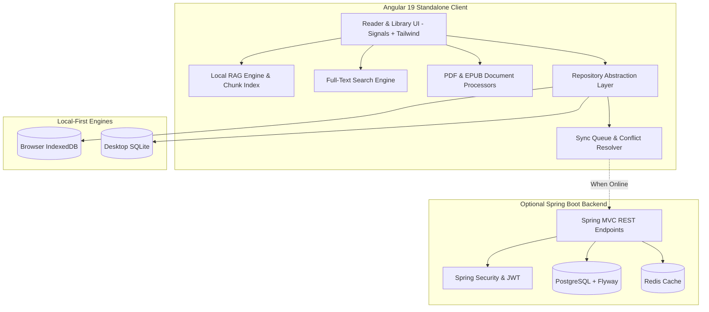

# Folio — Local-First Intelligent Digital Library

> A privacy-focused, offline-first digital library and document reader engineered with an Angular 19 standalone frontend, local RAG vector search with page citations, live multi-tab conflict resolution, and a Spring Boot cloud synchronization backend.

---

## 🌟 Flagship Highlights

- **100% Offline-First Architecture**: Zero external network dependency. Primary state and file storage execute directly against client-side IndexedDB / SQLite abstraction layers with collision-safe UUIDs.
- **Local RAG-Powered Book Q&A**: Extracts, chunks, and vector-indexes book passages to perform semantic retrieval and generate answers with exact page & chapter source citations offline via local Ollama (`llama3.2` / `nomic-embed-text`) and a built-in offline engine.
- **Visual Offline Sync & 3-Way Conflict Resolver**: Queues mutations offline with idempotency tokens and broadcasts across tabs using `BroadcastChannel`. Detects simultaneous modifications and renders an interactive side-by-side three-way diff & merge screen.
- **High-Scale Sub-50ms Full-Text Search**: In-memory tokenized full-text search indexing across metadata and extracted book contents with live query duration counters and highlighted snippet extraction.
- **Polished PDF & EPUB Readers**: Integrated with PDF.js and ePub.js featuring dynamic theme switching (Dark, Light, Sepia, Solarized), zoom/fit scaling, bookmarks, highlights, notes, and debounced reading progress persistence.

---

## 🏛️ Architecture Overview



---

## 📁 Repository Structure

```text
folio/
├── frontend/                   # Angular 19+ standalone frontend
│   ├── src/
│   │   ├── app/
│   │   │   ├── core/           # Models, storage abstractions, RAG, search, sync
│   │   │   ├── features/       # Library, Reader, Search, AI Q&A, Sync Demo, Settings
│   │   │   └── shared/         # Reusable navigation & layout components
├── backend/                    # Spring Boot 3 Java backend (Optional Cloud Sync)
│   ├── src/main/java/          # Controllers, services, JPA entities, DTOs, Security
│   └── src/main/resources/     # Flyway migrations (V1) & application.yml
├── desktop/                    # Tauri configuration for native desktop packaging
├── docker/                     # Multi-stage Dockerfiles & docker-compose.yml
└── .github/workflows/          # GitHub Actions CI/CD automation pipeline
```

---

## 🚀 Quick Start

### Frontend (Angular)

```bash
cd frontend
npm install
npm start
```
Navigate to `http://localhost:4200`.

### Backend (Spring Boot)

```bash
cd backend
mvn spring-boot:run
```

### Docker Compose (Full Stack)

```bash
cd docker
docker-compose up --build
```

---

## 🧪 Testing & Validation

```bash
# Frontend build & typecheck
cd frontend && npm run build

# Backend compilation
cd backend && mvn clean compile
```

---

## 📄 License

MIT License. Designed with engineering rigor and privacy by design.
